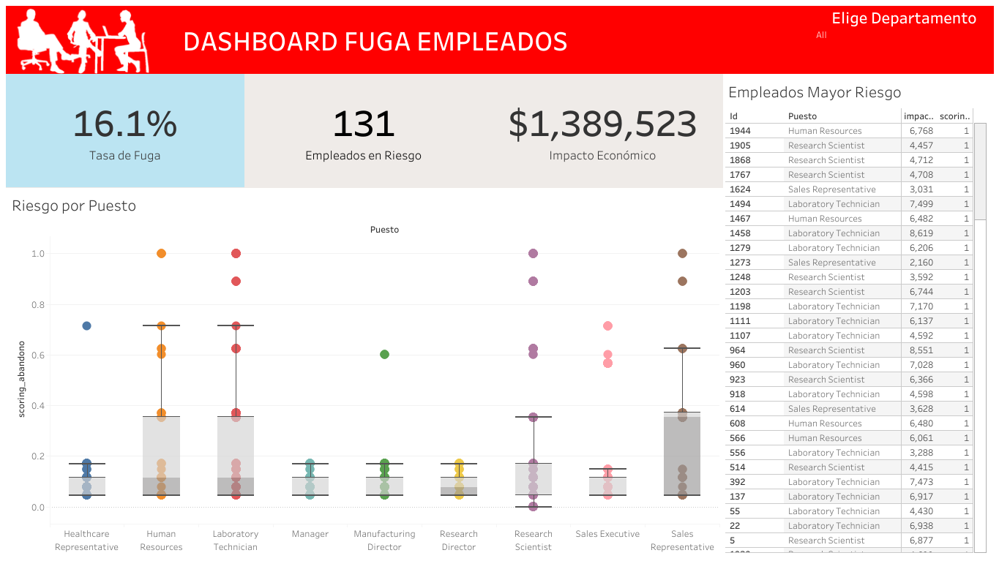

# PREDICCIÓN ABANDONO DE EMPLEADOS DATA SCIENCE

## Índice
* [Índice](#índice)
* [Descripción del Proyecto](#descripción-del-proyecto)
* [Análisis](#análisis)
* [Modelo-ML](#modelo-ml)
* [Dashboard](#dashboard)

## Descripción del Proyecto
Este proyecto utiliza como base el dataset "AbandonoEmpleados.csv", el cual expone todos los registros de los empleados de una empresa y su información actual. Partiendo de dichos datos, se realizó un análisis y, posteriormente, se implementó un modelo de Machine Learning que calcula la posibilidad de abandono por parte de los empleados, con el objetivo de realizar un dashboard que permita apoyar al equipo de RR.HH. para tomar acciones correctas en el sector correcto y así evitar la fuga de empleados.

## Análisis
Desarrollado en Jupyter Notebook, utilizando las librerias pandas, numpy y mathplotlib, consistió inicialmente en un análisis a vista de pájaro, observando, descartando e imputando las variables nulas y/o con falta de información. Posteriormente, se diferenciaron las variables númericas de las categóricas, procediendo a realizarles un Análisis Exploratorio de Datos (EDA) a ambos grupos. A partir de los resultados obtenidos se generaron diversos insights que 

## Modelo ML
Utilizando la librería ScikitLearn se transformaron todas las variables en numéricas. El modelo se implementó del tipo arbol de decisión, ofreciendo resultados del 70%. Finalmente, se integró al dataset original con los resultados para cada uno de los empleados.

## Dashboard
Diseñado en Tableau, se puede ver ingresando [aquí](https://public.tableau.com/views/DashboardAbandonoEmpleados_17277186571020/Dashboard1?:language=en-US&:sid=&:redirect=auth&:display_count=n&:origin=viz_share_link)

